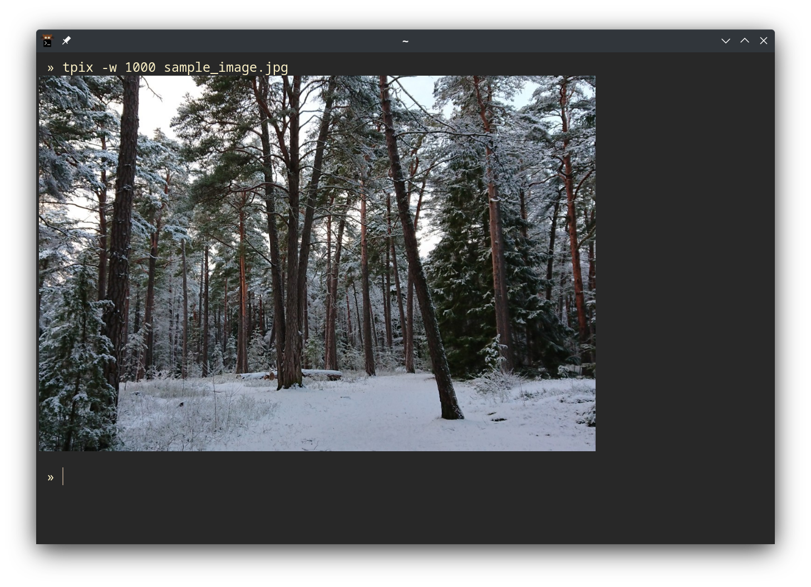

# tpix - a simple terminal image viewer using the kitty graphics protocol

`tpix` is a simple terminal image viewer written in [Nim](https://nim-lang.org/). It is compatible with terminal emulators that supports the [kitty graphics protocol](https://sw.kovidgoyal.net/kitty/graphics-protocol/) and uses the [Pixie](https://github.com/treeform/pixie) graphics library to read and render images. `tpix` is available as a statically linked single binary that is easy to deploy on remote systems where the user does not have root privileges.

`tpix` can view the following image formats: PNG, JPG, GIF (animated GIFs not supported), BMP, QOI, PPM and SVG (currently only limited support).

`tpix` has so far been compiled on x86_64 and arm64 Linux, x86_64 MacOSX, and it has been tested with [Kitty](https://sw.kovidgoyal.net/kitty/), [Wezterm](https://wezfurlong.org/wezterm/) and [Konsole](https://konsole.kde.org/) (version 22.4.1). Viewing images in Wezterm is slightly buggy at the moment and only one image will be shown at the time. None of these terminal emulators currently support showing images when using terminal multiplexers, such as tmux or screen.



### Background

As a bioinformatician, I am often working on remote servers and clusters where I don't have root access. Sometimes when analyzing data I want to generate quick plots, and viewing these plots directly in the terminal over SSH is a nice workflow. I previously had a Mac and used iTerm2, which can show images by using a simple bash script that can easily be installed on any system. Recently I moved to a Linux laptop, where I've been using the Kitty terminal emulator. Kitty has support for viewing images in the terminal and also requires a program to be installed on the computer that wraps the image data in a format that Kitty can understand. Unlike in the case of iTerm2 though, I have not been able to find such a program that can easily be installed on remote systems without root access. I therefor decided to write my own solution, where I wanted to create a single dependency-free binary that can easily be copied and run from any modern Linux system. For this purpose I picked the Nim language, as it is a compiled language that makes it easy to generate statically linked binaries.

### Installation

Linux binaries for x86_64 and arm64 that have been statically linked using musl is available at the [release page](https://github.com/jesvedberg/tpix/releases). A statically linked MacOSX x86_64 binary is also available. To install these, simply download and extract the available file suitable for your platform. For example:

```
wget https://github.com/jesvedberg/tpix/releases/download/v1.0.0/tpix-1.0.0-x86_64-linux.tar.gz
tar xzf tpix-1.0.0-x86_64-linux.tar.gz
```

To compile tpix from source make sure you have the [Nim compiler](https://nim-lang.org/) installed. The easiest way to compile and install tpix is by using the `nimble` package manager, which comes with the Nim compiler. This will install all necessary Nim dependencies (i.e. Pixie and Docopt).

```
nimble install https://github.com/jesvedberg/tpix
```

This will compile a dynamically linked executable. Another option is to clone this repository and compile directly with Nim, but then Pixie and Docopt also need to be installed, that is still easiest to do using Nimble. If compiling directly, various build options are defined in the `config.nims` file. For instance, `nim build_static` will create a statically linked binary and you can see other options in the `config.nims` file.

### Usage

By default `tpix` will show images that are smaller than the width of the terminal at their native size, and resize larger images to fit the terminal.

```
tpix image.jpg
```

Width and height can also be set manually, and resizing of large images can be turned off. `tpix` can also read image data from STDIN. Note that the image aspect ratio is preserved if only width or height is specified, but not if both of them are specified at the same time.

```
cat image.jpg | tpix
```

Full help message:

```
tpix - a simple terminal image viewer using the kitty graphics protocol

Usage:
  tpix [options] [FILE]...

Options:
  -h --help             Show help message.
  --version             Show version.
  -W --width WIDTH      Specify image width.
  -H --height HEIGHT    Specify image height.
  -f --fullwidth        Resize image to fill terminal width.
  -n --noresize         Disable automatic resizing.
  -b --background       Add white background if image is transparent.
  -p --printname        Print file name.
  ```
